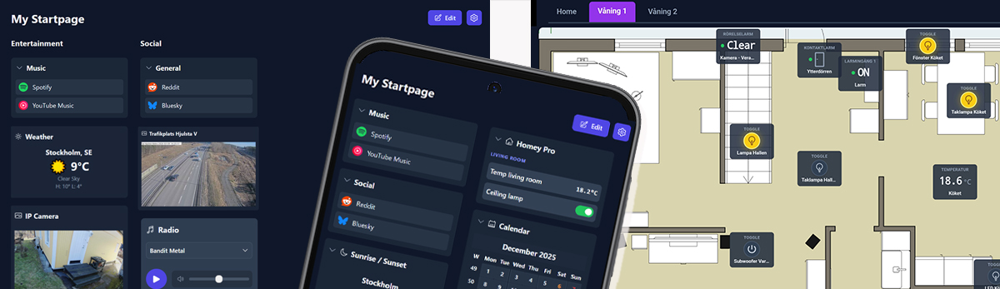

<div align="center">
  
</div>

# StartPanel
<i>Personal Control Center for your browser and Homey Pro</i>

🌍 Languages: **English** | [Svenska](README_sv.md) 🇸🇪 

StartPanel is a lightweight and customizable **browser start page and dashboard**, built with **TypeScript** and **Vite**.  
It allows you to collect links, widgets, and **Homey Pro controls** in one place, running entirely in the browser with no backend or database required.  
All settings and layout data are stored **locally in your browser**, giving you full control of your configuration.

## Key features

- Customizable **start page with links and widgets**
- **Homey dashboard** with live capability updates via Homey Cloud
- Flexible layouts including **column layout or free placement**
- Support for **background images / floorplan dashboards**
- Multiple tabs (for example per room, floor, or function)
- Installable as a **Progressive Web App (PWA)** for tablet or kiosk setups
- Runs directly from **GitHub Pages** or can be hosted locally

## Live demo

Run it directly in your browser:  
https://startpanelapp.github.io/


For documentation in **Swedish** 🇸🇪 go here -> [Svenska](README_sv.md)

---


# StartPanelApp – Web-based Start Page & Dashboard with Homey Integration

This is a web-based **start page / dashboard** written in **TypeScript**, developed with significant help from Google AI Studio.

> **Note:** This is *not* an official Homey app. It is a personal project that I originally built for my own use.

StartPanel combines a **start page and dashboard** where you can collect links and different widgets in one place.

All settings, widgets, favorite links, and layout data are automatically stored in your browser's **LocalStorage**, meaning nothing is stored externally.

For common questions, see the **FAQ section further down** on this page.

---

## Homey Pro 2023 Integration

To use StartPanel with **Homey Pro 2023**, you can connect through the **Homey Cloud**, run the app locally on a NAS, or simply use **webhooks**.  
Depending on how you run the app, you can view device status and control devices directly from the page.

---

# ⭐ How to Use StartPanelApp

## 1. Run directly from GitHub Pages (easiest)

Simply open:

👉 **https://startpanelapp.github.io/**

This is the easiest way to use StartPanelApp.

### Connecting to Homey

Requirements:

- A **Homey Pro 2023 or newer**
- Your **Homey ID**
- A **Homey API Key**

The connection is made through **Homey Cloud**, which provides **live updates**.

Alternatively, you can use **webhooks only**, which requires no authentication but provides limited functionality.  
(Webhooks also work with older Homey models.)

### Finding your Homey ID

Go to:
Settings → General → Cloud → Homey Cloud  
Copy the **Homey ID** and paste it into:  
StartPanel → **Settings → Homey → Homey ID**  

### Creating an API Key

Go to:  
Settings → API Keys  
Create a **new API key** and give it the required permissions  
(at minimum **Devices, Flows, and Variables**).  

Copy the key and paste it into:  
StartPanel → **Settings → Homey → API Key / Bearer Token**  

---

## 2. Install as an App (PWA)

This web app can be installed on Android using **Google Chrome** as a **Progressive Web App (PWA)**.

This provides a cleaner interface without the browser address bar and works perfectly for **tablet dashboards or kiosk setups**.

Steps may vary depending on device and Android version.

### Installation

1. Open the web app in **Google Chrome**
2. Tap **⋮ (three dots)** in the top-right corner
3. Select **Add to Home screen** or **Install App**
4. Confirm by tapping **Install**

The app will now appear among your other apps and can be launched like a normal application.

### Updates

The app updates automatically whenever a new version is published on GitHub.  
No manual reinstallation is required.

---

### 🔒 Optional: Enable Kiosk / Screen Pinning Mode on Android

This is perfect for a **dedicated Homey control panel** on a wall-mounted tablet.

Steps (may vary between Android devices):

1. Go to **Settings → Security**
2. Enable **Screen Pinning**
3. Open the StartPanel app
4. Tap the **Recent Apps** button
5. Tap the **pin icon**

The user can now not leave the app without entering the device PIN.

(Some Android devices may not support this feature.)

---

## See the **FAQ section further down** for additional help and tips.

---

## Advanced Usage

If you want to avoid cloud services or GitHub dependencies, you can run StartPanel locally on a NAS such as:

- Asustor
- Synology
- QNAP

When running locally, the system uses **polling instead of live updates**, meaning device updates occur with a small delay based on the selected polling interval.

⭐ Do I need to be on the same network as Homey?  

**Yes** – if you connect locally using polling.

**Exception:** If you use **VPN**, everything works normally because the connection behaves as if you were on the same local network.

**No** – if you connect through **Homey Cloud**, which works regardless of where the web page itself is hosted.

---

# Running StartPanel on a NAS (Apache, Nginx, Asustor, Synology, QNAP)

### 0. Make sure a web server is enabled on your NAS

If you do not already have a web server installed, see the instructions further below.

---

### 1. Open the project GitHub page

https://github.com/StartPanelApp/StartPanelApp.github.io

---

### 2. Download the required files

You only need:

- `index.html`
- the entire `/assets` folder

(The folder contains all JavaScript, CSS, and image files.)

---

### 3. Upload the files to your NAS web directory

Log into your NAS and open the web server (Apache, Nginx, etc.).

Most NAS systems have a folder called something like: “web”, “www” or similar.

Copy **index.html** and the entire **/assets** folder into that directory.

Important:

- `index.html` **must keep its name**
- `/assets` must be located in the **same folder**

Example structure:
```
/web
├── index.html
└── assets/
   └── (all JS/CSS/bilder)
```

### 4. Open the page in your browser

Go to for exempel:  
http://tour-nas-ip-address/

Or if you placed it in a subfolder, for example StartPanel:  
http://your-nas-ip-address/StartPanel/

---

### 5. The page should now load directly from your NAS.

---

### 6. Using Homey locally

To control devices and read status locally:

- You must be on the **same network as your Homey Pro**
- Or use **VPN**

Alternatively, you can still connect via **Homey Cloud**.

---

### 7. Local settings storage

All settings and links are stored in **LocalStorage**.

This means settings are unique for each **browser and device**.

However, you can create a **backup file** and restore it on another browser or device.

---

### 8. Webhooks

Webhooks work even when you are **not on the same network** as Homey.

However, reading device status requires the page to run:

- on the same network
- or through VPN.

---

# Installing a Web Server on Your NAS

Most NAS systems can run a simple web server capable of hosting static websites (HTML, CSS, JavaScript).  
That is all StartPanel requires.

---

### 1. Log in to your NAS admin interface

Open your NAS control panel in a browser, for example:  
http://your-nas-ip:5000  
(or another port depending on your NAS model)

---

### 2. Open the App / Package Center

Search for something like:
```
“Web Server”
“Apache”
“Nginx”
“Web Station”
“Hosting”
“WWW Server”
```
---

### 3. Install the web server

Install it with **default settings**.

Some NAS systems may also install:

- PHP
- MySQL

These are **not required** for StartPanel and can be ignored.

After installation, a web directory will be created, usually named something like:
```
/web
/www
/var/www
/home/www
/WebServer
/volume1/web (Synology)
```
This folder is what the web server serves when visiting your NAS IP address.

---

### 4. Restart the web server

Restart the service via the NAS control panel.

---

### 5. Done!

Your NAS is now running a web server, and you can proceed with the earlier instructions to install StartPanel.

💡 Tip:  
If you want to access the dashboard outside your home network, consider using **VPN**.

---

# 📌 FAQ (Frequently Asked Questions)

## ❓ How do I sync the dashboard between multiple devices?

The dashboard is stored locally in your browser using **LocalStorage** and is not stored in the cloud.

This is a **privacy-first design choice**, so settings must be copied manually between devices.

Steps:

1. Go to **Settings → Backup & Restore**
2. Click **Export Data** to download the JSON file
3. Move the file to another device (for example an iPad)
4. On the other device: **Settings → Backup & Restore → Import Data**

Done ✔

Make sure to **create backups regularly**.  
Store the backup file safely since it is **not encrypted**.

---
 
## ❓ Can the dashboard sync automatically between devices?

No.

Automatic synchronization would require a **cloud service, user accounts, or a backend server**.

StartPanel is intentionally designed to store all data **locally without login or external services**.

---

## ❓ Does the backup file contain sensitive information? (e.g. Homey tokens)

Yes, the backup file may contain:

- your dashboard layout
- widget configurations
- authentication tokens (for example Homey PAT)

This is not a security issue by itself, but the file should be treated as a **personal configuration file**.

Recommendations:

- store it in a safe location
- avoid sending it unencrypted
- do not share it unless you want to share your setup

This is part of the project's **privacy-focused design** — no data is sent to external services.

---
 
## ❓ Why is nothing stored in the cloud?

Because the project is designed to:

- run completely **offline**
- avoid **accounts, login systems, and backend servers**
- give users **full control over their data**
- avoid dependencies on cloud services that may disappear

It also aligns well with the general **Homey community preference of owning their own hardware setup**.

Because of this design, it is **extra important to create backups regularly**, since browser storage may be cleared due to:

- browser updates
- crashes
- app updates
- system changes

---
 
## ❓ Do I need to run it locally on a NAS?

No.

However, running locally can be useful if you want to access **local network resources**, such as images from IP cameras.

---

## ❓ Does it only work with Homey Pro 2023 and newer?

Yes, for full functionality (reading device status and controlling devices) when using **Cloud or polling**.

Using **webhooks only** may work with older Homey models.

Full functionality requires an **API token / PAT**, which is available on **Homey Pro 2023 and newer**.

---

## ❓ Can I view live video from IP cameras?

Yes, but several conditions must be met.

Example setup:

1. The camera must provide an **RTSP stream**
2. StartPanel must run locally on a **web server** (for example on a NAS)
3. **go2rtc** must run on the NAS using **Docker**
4. The RTSP stream must be **H.264** (not H.265)
5. The video can normally only be viewed on the **same network** or via **VPN**
6. Use the **Iframe widget** with the go2rtc stream URL, for example:
http://192.168.1.3:1984/stream.html?src=kamera1

go2rtc acts as a **bridge**, converting the RTSP stream into a format that browsers can play.

It works well but requires some setup.

<div align=left></div>

---

## ❓ Can I show still images from IP cameras?

Possibly.

If the app runs locally on a NAS web server, the **Image widget** may be able to fetch camera snapshots.

Each manufacturer uses different URLs, and not all cameras support this feature.

Example (Foscam V5P):  
https://192.168.1.X/cgi-bin/CGIProxy.fcgi?cmd=snapPicture2&usr=NAME&pwd=PASSWORD  

Insert the URL into the **Image widget** and set a refresh interval (for example **60 seconds**).

Note that browser security restrictions may sometimes block such requests.

---

## ❓ Why do some link icons sometimes show only a letter?

This behavior is caused by factors outside the app's control:

**Icon service caching**  
Icon providers use their own cache. If they fail to fetch an icon once, they may remember the failure for a while.

**Temporary service outages**  
Icon services may be temporarily unavailable or overloaded.

**Websites blocking icon scraping**  
Some websites block automated services that try to fetch their icons.

**Browser cache**  
Your browser may cache a broken image or failed request.

In many cases the icon appears again automatically later.

---

## ❓ Can I create multiple dashboards?

Yes.

Go to **Settings → Dashboards**.

There you can:

- create additional dashboards
- edit existing ones
- choose whether they appear as **tabs** or in a **dropdown menu**

---

## ❓ Why are old versions kept in the `/assets` folder?

If a new version causes problems, you can revert to a previous version by editing **index.html** and pointing it to an older `.js` file in `/assets`.

You can see which file belongs to which version on GitHub under:  
/docs/assets

---

## ❓ Is this an official Homey app?

No.

---

## ❓ Will updates erase my data?

Normally **no**.

The dashboard configuration is stored in **LocalStorage**, which is not affected by normal code updates.

However, data could be lost if:

- the browser clears storage
- the storage schema changes
- major version upgrades occur
- browser extensions interfere
- the environment changes (for example moving to a new NAS)

For this reason, **regular backups are strongly recommended**.

---

## ❓ Is the app free?

Yes.

Occasionally a small **donation banner** may appear encouraging support for a **cat shelter**.  
This is completely optional.

---

## ❓ Does the dashboard update in real time?

**Yes** when connected through **Homey Cloud**.

**No** when running locally using **polling**.

Polling means the app checks Homey for updates at a set interval, for example:

- every 10 seconds
- every 20 seconds
- every 30 seconds

You can configure this under:

**Settings → Homey → Polling Interval**

---

## ❓ Do I need a Homey to use this app?

No.

You can use StartPanel purely as a **start page with widgets**.  
Homey integration is simply an optional feature.

---


## ❓ Can I add road / traffic cameras to the dashboard?

Example for **Sweden (Trafikverket / Trafiken.nu)**

<div align=left></div>

You can add traffic cameras as automatically refreshing **still images**.

### 🌍 Where do the cameras come from?

Examples:

- Trafiken.nu (Stockholm, Gothenburg, etc.)
- Trafikverket (nationwide Sweden)

Images typically update **about once per minute**.

### 🧩 How do I find the image URL?

The image URLs are not publicly listed, but you can find them like this:

1. Open the camera page in Chrome or Firefox
2. Press **F12** to open Developer Tools
3. Go to the **Network** tab
4. Wait for the camera image to refresh
5. Look for a file ending in **.jpg**
6. Right-click → **Copy URL**

That is the direct image URL.

### 🖼 Add it to StartPanel

1. Add the **Image widget**
2. Paste the image URL
3. Set a refresh interval (for example **60 seconds**)

Done ✔

---

## ❓ Why can't I link to local HTML files or apps on my device?

Browsers block links that attempt to open local files or launch apps directly for **security reasons**.

This prevents links such as:  
file://  
C:\…   
app://   
or local .html-files. 

This is a standard browser security feature designed to protect users.

---

Visit **https://startpanelapp.github.io/** to try the app live.


