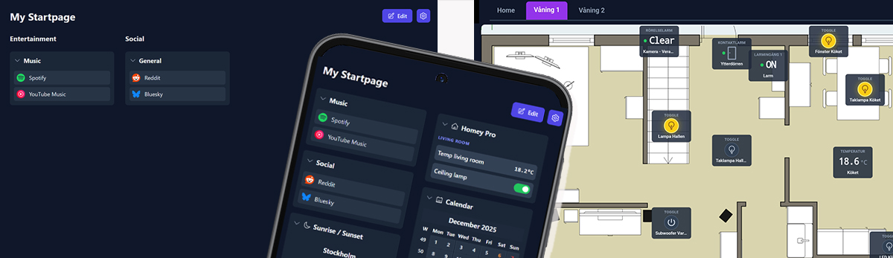

<div align=center></div>

# StartPanel

A lightweight personal start page written in **TypeScript**, built with **Vite**, and designed to be fast, clean, and fully customizable.  
Local preferences are stored directly in your browser, so no external database or backend is required.

The rest of this documentation is written in **Swedish**.

---


# StartPanel – Webbaserad start- och dashboardsida

Detta är en webbaserad start-/dashboardsida gjord i **TypeScript** med stor hjälp av Google AI Studio.  
Och det är en **öppen källkod**.

> **Obs:** Detta är *inte* en officiell Homey-app, utan något jag byggt för privat bruk egentligen.

Det är en kombination av **startpage och dashboard** där du kan samla länkar och olika widgets.  

För vanliga frågor FAQ, se längre ner på sidan.  

## Integration med Homey Pro 2023

För att använda den mot Homey Pro 2023, använder du antingen webhooks eller kör appen lokalt på din dator eller på en NAS.  
Du kan se status och styra enheter direkt från sidan (beroende på hur du kör appen).

---

# ⭐ Hur du kan använda sidan


## 1. Kör direkt från GitHub Pages (enklast)

Gå bara till adressen:

👉 **https://startpanelapp.github.io/**

Det här är det absolut enklaste sättet att använda sidan.

**För att ansluta till Homey:**

- Du måste ha en Homey Pro 2023 eller nyare
- Du behöver ditt Homey ID-nr och en API-kod. Och sen sker anslutningen via Homey Cloud, med LIVE uppdateringar!
- Alternativt använder du bara **webhooks**, då behövs inga koder eller behörighet, men är väldigt begränsat. Fungerar med äldre Homey.

**Läsa ut Homey ID-nr:**
Du hittar ditt Homey ID nr här
Settings > General (Allmänt) > Cloud (Moln) > Homey Cloud

**Skapa API-kod:**
Inställningar > API-nycklar. Skapa Ny API Nyckel. ge den alla behörigheter som behövs (minst Enheter, Flows, Variabler). 
Kopiera koden och klistra in i appen Settings > Homey > "API Key / Bearer Token".

---

## 2. Installera som en App (PWA)

Den här webbappen kan installeras som en vanlig app på din Android enhet med Chrome, en så kallad PWA App.
Detta ger ett renare gränssnitt utan adressfält och fungerar perfekt i kiosk-läge.

1. Öppna webbappen i Google Chrome
2. Tryck på ⋮ (tre punkter uppe till höger)
3. Välj "Lägg till på startskärmen" (eller installera App beroende på version)
4. Bekräfta genom att trycka Installera

Appen hamnar nu bland dina andra appar och kan startas som vilken annan app som helst.

** Uppdateringar **

Appen uppdateras automatiskt när nya versioner publiceras på GitHub.
Ingen manuell ominstallation behövs.

🔒 ** (Valfritt) Aktivera kiosk / låst läge på Android **

Perfekt för en dedikerad kontrollpanel för Homey Pro 2023
För väggmonterad surfplatta rekommenderas skärmfästning i Android:

- Gå till Inställningar → Säkerhet
- Aktivera Skärmfästning
- Öppna appen
- Tryck på Översiktsknappen (senaste appar)
- Tryck på nålikonen för att fästa appen

Nu kan användaren inte lämna appen utan PIN-kod.
(Förfarande ovan KAN skilja sig rejält mellan Android enheter, och vissa saknar denna funktion helt)

---

## Avanverat

## 3. Köra lokalt på en NAS (med en webserver som Apache eller liknande)

Om du vill köra sidan på en NAS (t.ex. Asustor, Synology, QNAP) måste du använda de kompilerade HTML/JavaScript-filerna.

De färdiga kompilerade filerna du behöver är:


⭐ Måste jag vara i samma nätverk som Homey?

Nej - om du ansluter till Homey via molnet
Ja – om du vill ansluta lokalt och använda polling. Undantag: Om du använder VPN funkar allt fullt ut var du än är, för det blir som att du kör lokalt.

---

## Instruktioner för att köra StartPanel på en NAS (Apache, Nginx, Asustor, Synology, QNAP)

0. **Du måste ha en webserver aktiverad på din NAS** - har du inte redan det, hoppa ner till separata instruktioner för detta längre ner!

1. Öppna projektets GitHub-sida https://github.com/StartPanelApp/StartPanelApp.github.io

2. Ladda ner filerna till din dator. Det du behöver är:

index.html och hela mappen “/assets” (med alla JavaScript-, CSS- och bildfiler)

3. Logga in på din NAS och öppna den webserver du använder (t.ex. Apache eller Nginx). 
På de flesta NAS finns en mapp som heter “web”, “www” eller liknande där man placerar webbfiler.

Kopiera filen index.html och hela mappen /assets till webserverns katalog på din NAS. Det är mycket viktigt att både index.html och mappen /assets ligger på samma nivå i samma mapp, alltså tillsammans sida vid sida.
(Byt inte namn på index.html — den måste heta exakt så för att webbsidan ska fungera som förväntat.)

Strukturen i webbkatalogen ska alltså se ut så här:
```
/web
├── index.html
└── assets/
   └── (alla JS/CSS/bilder)
```

4. När filerna ligger på plats, öppna webbläsaren och gå till adressen för din NAS webbserver, till exempel:  
http://din-nas-ip-adress/

eller om du lade filerna i en undermapp:  
http://din-nas-ip-adress/StartPanel/

5. Sidan ska nu starta direkt från NAS:en. 

6. Om du vill använda Homey-integration (styra enheter och hämta status) lokalt måste du befinna dig i samma nätverk som din Homey Pro. Alternativt kan du använda VPN. Då fungerar allt på samma sätt som om du var hemma. Eller ansluta direkt via Homey Cloud.

7. Alla inställningar och favoritlänkar du skapar sparas automatiskt i webbläsaren via LocalStorage. Det innebär att inställningarna är unika för varje webbläsare och enhet du använder. (Du kan göra backup och läsa in den filen i en annan webbläsare)

8. Webhooks fungerar även om du inte är i samma nätverk som Homey, men att läsa status och enhetsvärden kräver att webbsidan körs lokalt på samma nätverk eller via VPN som sagt.

---

## INSTALLERA EN WEBSERVER PÅ DIN NAS

**Så här startar du en webserver på din NAS (generella instruktioner)**

De flesta NAS-enheter kan köra en enkel webbserver som låter dig visa statiska webbsidor (HTML, CSS, JavaScript). Det är allt som behövs för StartPanel. Så här gör du oavsett NAS-modell:

1. **Logga in i din NAS administrativa webbpanel via webbläsaren** (t.ex. http://din-nas-ip-adress:5000 eller http://din-nas-ip-adress:8000 beroende på modell).

2. **Öppna NAS:ens app-/paketcenter.**
Sök efter någon av följande:
```
“Web Server”
“Apache”
“Nginx”
“Web Station”
“Hosting”
“WWW Server”
```
3. **Installera webservern med standardinställningar.**
På vissa NAS-modeller aktiveras även PHP eller MySQL, men det behövs inte för denna app — du kan ignorera alla sådana extra funktioner.
När webservern är installerad finns det alltid en webbmapp där du ska lägga dina filer. Den brukar heta något i stil med:
```
/web
/www
/var/www
/home/www
/WebServer
/volume1/web (Synology)
```
Webbmappen är den katalog som webservern visar när du går till din NAS IP-adress i webbläsaren.

4. **Starta om webservern via NAS kontrollpanel** (ofta heter det “Restart Service”).

5. **Klart!**
Din NAS kör nu en lokal webbserver, nu kan du återgå till att installera själva appen StartPanel enligt tidigare punkt på din NAS.

Tips:
Om du vill komma åt sidan även utanför hemmet kan du använda VPN.

---

# 📌 FAQ (vanliga frågor)

## ❓ Hur synkar jag dashboarden mellan flera enheter?

Dashboarden sparas lokalt i webbläsaren (LocalStorage) och lagras inte i molnet.
Det är ett privacy-first designval, så man får helt enkelt kopiera settings filen till en ny webbläsare manuellt.

Så här gör du:

1. Settings > Backup & Restore

2. Tryck Export Data → ladda ner JSON-filen

3. Flytta filen till en annan enhet (t.ex. iPad)

4. På andra enheten: Settings > Backup & Restore > Import Data

Klart ✔  
Se till att göra Backup ofta! Och förvara filen utom räckhåll från obehöriga då den inte är krypterad! 
 
## ❓ Kan dashboarden synka automatiskt mellan enheter?

Nej. En sådan möjlighet skulle kräva en molnlagring, konto eller någon extern backend — projektet är byggt för att spara sin data helt lokalt, utan server och login.
 
## ❓ Innehåller backupfilen känsliga uppgifter? (t.ex. Homey PAT-tokens)

Ja, backupfilen kan innehålla:

- din dashboard-layout
- widgetkonfigurationer
- eventuella tokens (t.ex. Homey PAT)

Det är ingen säkerhetsrisk i sig, men filen bör hanteras som en personlig konfigurationsfil:

- lagra den på en trygg plats
- undvik att skicka den okrypterat
- dela den inte om du inte vill dela din setup

Detta är en del av projektets integritetsvänliga upplägg — ingen information skickas till molntjänster eller tredje part.
 
## ❓ Varför sparas inget i molnet?

För att:

- kunna köras helt offline
- undvika konton / login / backend
- ge användaren full kontroll över sina data
- undvika molnberoenden (t.ex. tjänster som läggs ner)

Dessutom passar det bra ihop med Homey-användares generella preferens att äga sin setup med egen hårdvara.  
Med detta sagt är det <b>extra viktigt</b> att du gör backup regelbundet, för din webbläsare kan tappa inställningarna vid en uppdatering, crash, app-uppdatering osv!
 
## ❓ Måste jag köra lokalt på en NAS?

Nej.
 
## ❓ Fungerar den bara med Homey Pro 2023/2026?

Ja, när moln eller polling används (läsa + styra).
Med enbart Webhook (skicka kommandon) kan äldre modeller fungera.

(PAT / API-kod behövs för full funktion — och det har Homey Pro 2023 och nyare.)

## ❓ Varför syns bara en bokstav och inte ikonen till länkarna ibland?

Det sporadiska beteendet du ser beror på flera faktorer som är utanför appens direkta kontroll:  
- Tjänsternas Cache: Ikon-tjänsterna har sin egen "cache" (ett temporärt minne). Om en tjänst misslyckas med att hämta en ikon en gång, kan den "komma ihåg" det misslyckandet ett tag. När deras cache sedan uppdateras (vilket kan ta timmar eller dagar), kan ikonen plötsligt dyka upp igen. Samma sak gäller omvänt – en fungerande ikon kan försvinna om tjänstens cache av någon anledning blir korrupt.
- Tillfällig Otillgänglighet: Tjänsterna vi använder kan ha korta avbrott eller vara överbelastade. Om appen försöker hämta en ikon precis under ett sådant avbrott, misslyckas det. Nästa gång du laddar sidan kan tjänsten fungera igen.
- Webbplatser som blockerar: Vissa webbplatser gillar inte att automatiska tjänster hämtar deras ikoner och kan blockera dem. Detta kan ändras över tid.
- Din webbläsares cache: Även din egen webbläsare har en cache. Den kan ibland hålla kvar en trasig bildfil eller ett misslyckat försök att ladda en bild, vilket gör att ikonen inte visas förrän cachen rensas eller uppdateras.

## ❓ Kan man ha flera Dashboards?
Ja, det kan man.  
Gå in under Settings > Dashboards. Där skapar du fler och redigerar befintliga.  
Du kan välja om de ska synas som tabs eller som en drop-down meny.  

## ❓ Varför ligger gamla versioner kvar under /assets?

Ifall en ny version ställer till det kan man backa genom att redigera sin index.html-fil genom att ändra vilken .js fil den pekar på under /assets.  
Vilken version respektive .js fil är ser man på GitHub under /docs/assets

## ❓ Är detta en officiell Homey App?

- Nej

## ❓ Vad händer vid uppdateringar – försvinner min data?

I normalfallet nej.
Dashboarden ligger i webbläsarens LocalStorage och påverkas inte av vanlig koduppdatering.

<b>Men</b> det kan hända om:
- webbläsaren rensar data
- appen byter storage-schema
- stora versionshopp görs
- browser addons påverkar storage
- användaren bygger om miljön (t.ex. ny NAS)

Därför rekommenderas starkt Backup & Restore regelbundet.

## ❓ Är appen gratis?

Ja.  
Det enda är att en liten donations banner dyker upp med långa mellanrum om att stödja kattstallet, vilket är helt friviligt så klart. Det är det enda.

## ❓ Uppdaterar dashboarden i realtid? 

Ja - när du ansluter via molnet.

Nej - när du ansluter lokalt och dashboarden använder polling för att hämta sensorer och enhetsstatus från Homey.
(Polling betyder att appen frågar Homey med ett visst tidsintervall, t.ex. var 10 sek, var 20 sek, var 30 sek osv.)
Du kan själv ställa in intervallet under Settings > Homey > Polling Interval.

## ❓ Måste jag ha en Homey för att använda den här appen?

Nej, det går utmärkt att bara köra den som den är som en startsida med widgets. Homey Pro är mer en extra funktion egentligen.

## ❓ Hur får jag in väg- / trafik-kameror i dashboarden?

Det går att lägga till trafikkameror som automatiskt uppdaterande bilder (stillbilder), t.ex. från Trafiken.nu eller Trafikverket.

### 🌍 Var finns kamerorna?

Du kan hämta dem från t.ex:

- Trafiken.nu (Stockholm, Göteborg m.fl.)

- Trafikverket (rikstäckande)

De publicerar stillbilder som uppdateras ~1 gång per minut.

### 🧩 Hur hittar jag själva bild-URL:en?

Det är den kluriga delen — bildadresserna skyltas inte öppet, men går att hitta så här:

1. Öppna t.ex. Trafiken.nu i Firefox eller Chrome

2. Välj en kamera du vill titta på

3. Tryck F12 → öppna webbutvecklarverktygen

4. Gå till fliken Network / Nätverk

5. Vänta tills sidan uppdaterar kamerabilden

6. Leta efter en fil som slutar på .jpg (eller liknande)

7. Högerklicka → Copy URL / Kopiera länkadress

Detta är den direkta bildlänken till kameran.

### 🖼 Hur lägger jag in den i dashboarden?

1. Lägg till widgeten Image

2. Klistra in bild-URL:en

3. Ställ in update interval t.ex. 60 sek (lagom för trafikbilder)

Klart ✔


## ❓ Varför kan man inte lägga in länkar till lokala HTML-sidor eller appar på datorn/mobilen?

Webbläsare blockerar av säkerhetsskäl länkar som skulle kunna öppna lokala filer eller köra appar direkt på din enhet. Detta förhindrar t.ex. länkar till file://, C:\…, app://, eller lokala .html-filer samt direkta appstarter. Det är en säkerhetsfunktion i webbläsare för att skydda användaren.

---

Besök [StartPanel på GitHub Pages](https://startpanelapp.github.io/) för att testa appen live!


